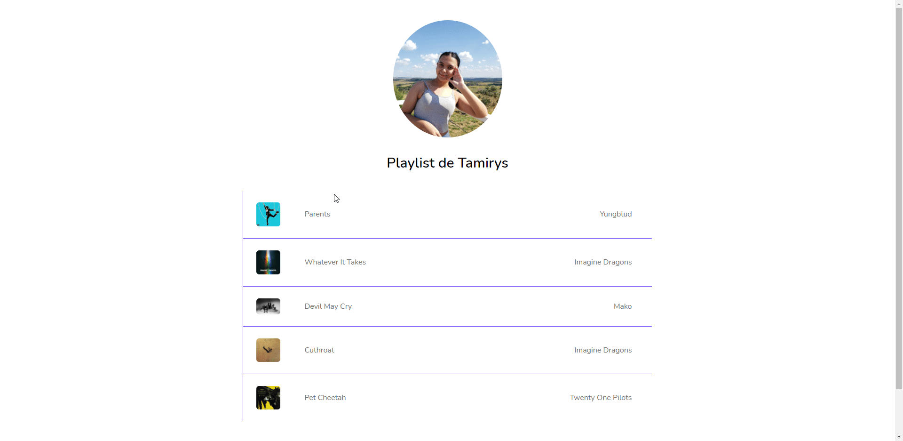

<h1 align="center">
     
     
    PlayList
</h1>

        

<h4 align="center">
    Nesse projeto pude desenvolver uma playlist aperfeiçoando o desafio que foi proposto no curso do ProgramadorBR. Fiz um player e mostrei as músicas tocando no momento, assim como as músicas disponíveis. Usei todos os meus conhecimentos adquiridos até então como arrays, objetos, HTMLDoom, laços de repetição e funções. Foi um desafio e tanto, mas gostei de cada parte feita.
</h4>
 

     
    

 

### 🚀 Tecnologias Utilizadas
 

- HTML5
- CSS3
- JavaScript

 

### 🌐 Vercel
Aqui você pode visualizar o projeto, é só clicar em:
[PlayList](https://play-list-bay.vercel.app/)

  

#### 📝 Licença
O projeto contém a licença MIT. Para mais informações acesse [LICENSE](https://github.com/tamirysnogueira/PlayList/blob/master/LICENSE).

 

Feito com 💖 por TamirysNogueira. [Get in Touch!](https://www.linkedin.com/in/tamirys-nogueira-346958205/)